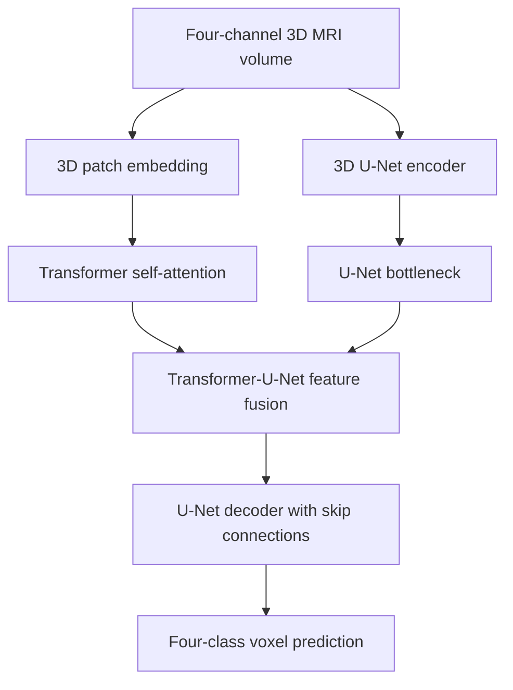

# 3D-sViT-UNET: Brain Tumor Segmentation

An implementation of **3D-sViT-UNET**, a hybrid 3D Transformer and U-Net framework for volumetric brain glioma segmentation. The model combines global contextual representations from a 3D vision-transformer branch with local spatial features from a 3D U-Net encoder-decoder.

## Associated Publication

This code is associated with the following published paper:

> S. Hussain, U. Sadiq, L. Fahad, and A. R. Shahid, “3D-sViT-UNET: An Effective Framework for Enhanced Brain Glioma Segmentation,” 2024.

- [IEEE Xplore paper](https://ieeexplore.ieee.org/document/10838347)

### BibTeX

```bibtex
@inproceedings{hussain2024sVitUNET,
  author    = {Hussain, Sadam and Sadiq, Usman and Fahad, Labiba and Shahid, Ahmad Raza},
  title     = {3D-sViT-UNET: An Effective Framework for Enhanced Brain Glioma Segmentation},
  year      = {2024},
  booktitle = {2024 International Conference on Frontiers of Information Technology (FIT)},
  publisher = {IEEE},
  url       = {https://ieeexplore.ieee.org/document/10838347}
}
```

## Overview

Brain tumor segmentation requires both:

- **Local detail:** accurate boundaries and fine-grained spatial features.
- **Global context:** relationships across the complete 3D MRI volume.

3D-sViT-UNET addresses these needs through two parallel feature-extraction paths:

1. A 3D vision-transformer branch that converts the input volume into patch tokens and models long-range relationships with multi-head self-attention.
2. A 3D U-Net branch that learns hierarchical convolutional features and reconstructs the segmentation with skip connections.
3. A feature-fusion block that combines the Transformer and U-Net bottleneck representations before decoding.
4. A four-class segmentation head that produces a voxel-wise prediction volume.

## Architecture



### 3D Transformer branch

The `mViT3D` branch:

- Uses a `Conv3d` patch-embedding layer with a `16 × 16 × 16` kernel and stride.
- Expects a `128 × 128 × 128` volume, producing `8 × 8 × 8 = 512` patch tokens.
- Projects each token to a 512-dimensional embedding.
- Adds learned positional embeddings.
- Applies four Transformer layers with eight attention heads.
- Reshapes the token sequence back into a 3D feature map with 512 channels.

### 3D U-Net branch

The convolutional branch contains:

- Four encoder stages with channel sizes `16 → 32 → 64 → 128`.
- Four `MaxPool3d` downsampling operations.
- A 256-channel bottleneck with dropout.
- Transposed-convolution upsampling.
- Skip connections from encoder stages to decoder stages.
- Decoder channel sizes `128 → 64 → 32 → 16`.

### Transformer-U-Net fusion

The Transformer output has 512 channels and the U-Net bottleneck has 256 channels. They are concatenated into a 768-channel feature map and fused with 3D `1 × 1 × 1` convolutions, batch normalization, and LeakyReLU activation before decoding.

## Model Configuration

| Parameter | Current implementation |
|---|---:|
| Input channels | 4 |
| Input volume size | `128 × 128 × 128` |
| Patch size | `16 × 16 × 16` |
| Transformer embedding dimension | 512 |
| Transformer attention heads | 8 |
| Transformer layers | 4 |
| Transformer hidden dimension | 4095 |
| Transformer dropout | 0.5 |
| Attention dropout | 0.5 |
| Output classes | 4 |

The four input channels represent the modalities or channels defined by the preprocessing pipeline. Their order must remain consistent during training and inference.

## Project Structure

```text
.
├── model.py                         # 3D-sViT-UNET architecture
├── Loss and Evaluation Metrics.py   # Combined loss and tumor-region Dice metrics
└── README.md
```

The supplied files contain the model definition and metric utilities. A dataset loader, preprocessing pipeline, training loop, checkpoint manager, and inference script are not included in the provided code and must be added for a complete end-to-end experiment.

## Installation

Create a virtual environment and install the core dependencies:

```bash
python -m venv .venv
```

Activate it on Windows:

```powershell
.\.venv\Scripts\Activate.ps1
```

Activate it on Linux or macOS:

```bash
source .venv/bin/activate
```

Install PyTorch for your hardware, then install the project dependency used by the model:

```bash
pip install torch einops
```

If your data pipeline uses NIfTI MRI files, install the corresponding medical-image I/O package used by that pipeline, such as `nibabel`.

## Important Compatibility Note

The current `model.py` contains this notebook command:

```python
!pip install einops
```

That syntax works in a Jupyter/Colab cell but causes a syntax error when `model.py` is imported as a normal Python module. Install `einops` from the terminal and remove or comment out that line before importing the model in a `.py` training script.

The metric file also relies on imports from the surrounding notebook or training script. Before importing it as a module, ensure these imports are available:

```python
import torch
import torch.nn as nn
import torch.nn.functional as F
from einops import rearrange
```

Because the filename contains spaces, rename it for normal Python imports:

```text
Loss and Evaluation Metrics.py  →  loss_and_metrics.py
```

## Input and Output Tensors

The model is designed for:

```text
Input:  (batch, 4, 128, 128, 128)
Output: (batch, 4, 128, 128, 128)
Target: (batch, 128, 128, 128)
```

- The input is a four-channel 3D volume.
- The output contains four softmax probability channels.
- The target contains integer voxel labels from `0` through `3`.

Example forward pass:

```python
import torch
from model import CombinedModel, minivit_config

device = torch.device("cuda" if torch.cuda.is_available() else "cpu")
model = CombinedModel(minivit_config).to(device)
model.eval()

volume = torch.randn(1, 4, 128, 128, 128, device=device)

with torch.no_grad():
    probabilities = model(volume)
    prediction = probabilities.argmax(dim=1)

print(probabilities.shape)  # torch.Size([1, 4, 128, 128, 128])
print(prediction.shape)     # torch.Size([1, 128, 128, 128])
```

The example uses random data only to verify tensor shapes; it is not a clinical prediction.

## Loss Function

The `Loss` class combines class-weighted cross-entropy with a foreground Dice term:

```text
total_loss = (1 - alpha) × cross_entropy + alpha × (1 - dice)
```

Default behavior:

- `alpha = 0.5`.
- The Dice component excludes the background channel.
- The cross-entropy component supports class weights.
- The target is converted to one-hot form for the Dice calculation.

### Training interface note

The current `FCNHead` applies `Softmax` before returning the model output, while `Loss.forward()` applies `F.cross_entropy()`. Standard PyTorch practice is to pass raw logits to cross-entropy and apply softmax only for inference. Review this interface before training to avoid applying incompatible activations twice.

Also note that `Loss.__init__()` currently calls `weight.cuda()`, so CPU training requires changing the weight handling to use the selected device.

## Evaluation Metrics

The `cal_dice()` function first takes the `argmax` prediction and returns three region-level Dice scores:

| Metric | Label interpretation in the supplied code |
|---|---|
| ET | Label `3` |
| TC | Labels `1` or `3` |
| WT | Any non-background label, i.e. `1`, `2`, or `3` |

The code comment states that the original label `4` has been remapped to label `3`. Confirm this mapping against your dataset before reporting results.

The Dice coefficient is computed as:

```text
Dice = 2 × intersection / (prediction volume + target volume)
```

with a small epsilon added for numerical stability.

Example metric usage:

```python
from loss_and_metrics import cal_dice

dice_et, dice_tc, dice_wt = cal_dice(probabilities, target)
print("ET:", dice_et.item())
print("TC:", dice_tc.item())
print("WT:", dice_wt.item())
```

## Dataset Preparation

The provided code does not define a dataset format or preprocessing routine. A training pipeline should:

1. Load four aligned 3D MRI channels.
2. Apply consistent orientation, spacing, cropping, and/or resampling.
3. Normalize each channel using a documented strategy.
4. Convert the segmentation mask to integer labels `0–3`.
5. Return tensors with the shapes documented above.
6. Split data by patient rather than by individual slices or patches to avoid data leakage.

Keep the preprocessing configuration, label mapping, patient split, and random seed with the experiment record.

## Recommended Training Workflow

1. Prepare and validate the volumetric dataset.
2. Instantiate `CombinedModel(minivit_config)`.
3. Select a device and move the model, input tensors, targets, and class weights to that device.
4. Review the logits/softmax interface before selecting the loss.
5. Train with checkpointing and validation after each epoch.
6. Track ET, TC, and WT Dice separately, together with loss and memory usage.
7. Evaluate on a patient-level held-out test set.
8. Save qualitative overlays and representative 3D predictions.

## Limitations

- The repository snapshot contains architecture and metric code, not a complete training or deployment pipeline.
- Input channels, preprocessing, dataset split, and class semantics must be documented by the experiment owner.
- The current implementation fixes several dimensions internally, including four input channels, 16-voxel patches, 512-dimensional embeddings, an `8 × 8 × 8` Transformer feature grid, and four output classes.
- The fusion module uses concatenation and convolutional projection; despite the surrounding comments, it is not a conventional query-key-value cross-attention layer.
- The current loss/output activation interface requires review before training.
- The model is a research implementation and is not a certified medical device or a substitute for clinical judgment.

## Responsible Use

This project is intended for research and educational use. Brain tumor segmentation outputs must be validated by qualified medical professionals and should not be used alone for diagnosis, treatment planning, or patient management.

## License and Data

No software license or dataset license is specified in the supplied files. Add the appropriate license, dataset citation, ethics statement, and usage restrictions before public redistribution or clinical research use.
